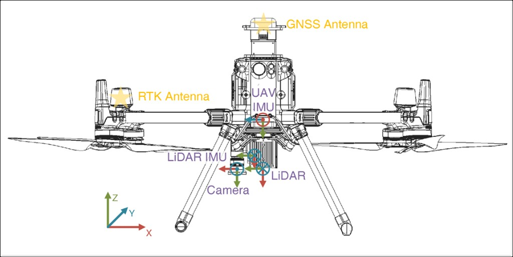
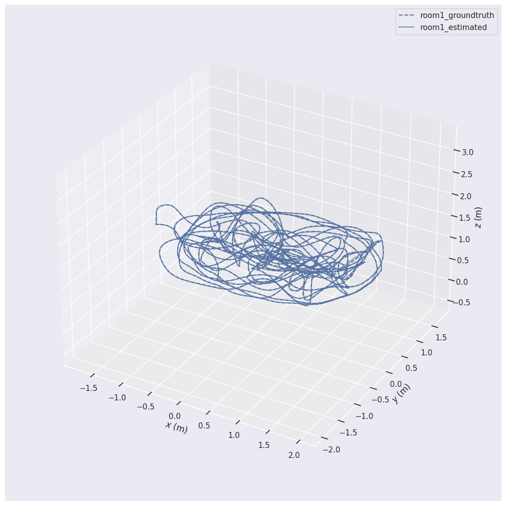
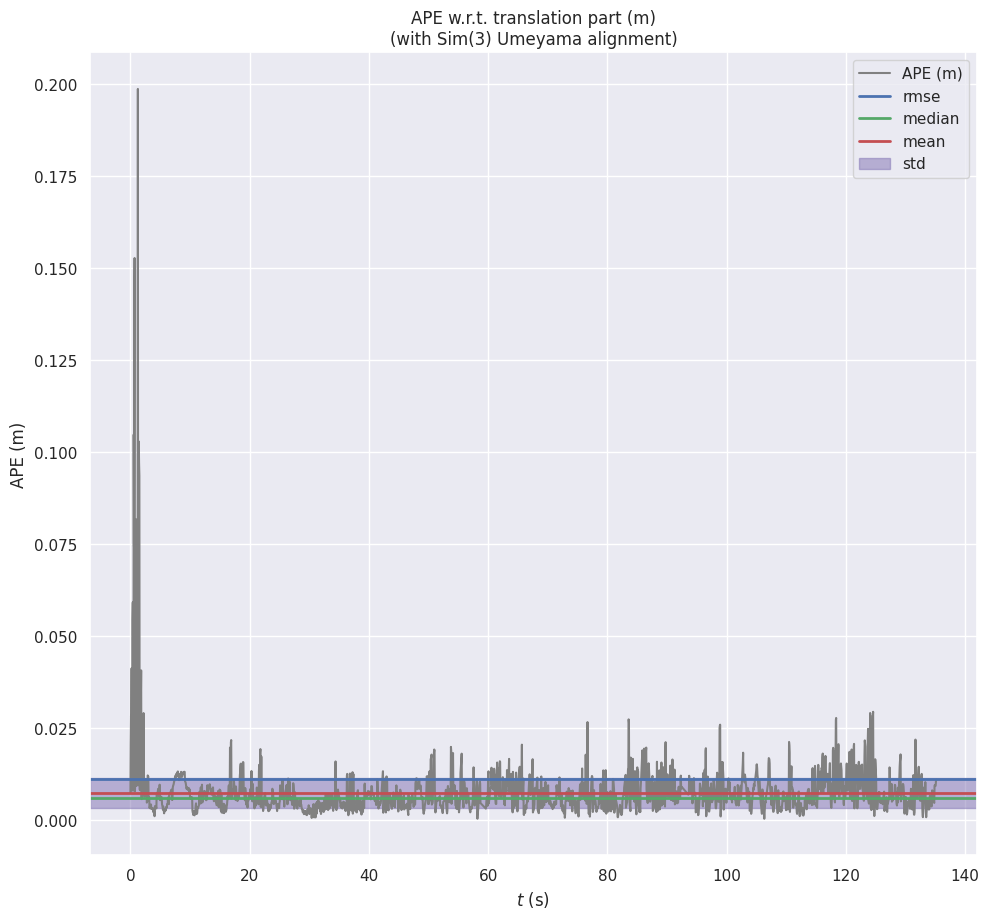

# ORB-SLAM3 on DJI Drone Aerial Imagery (AMtown02)

**Course:** AAE5303 — Robust Control Technology in Low-Altitude Aerial Vehicle  
**Student:** ZHANG Shuyang  
**Institution:** The Hong Kong Polytechnic University

---

## Research Objective

Evaluate and improve ORB-SLAM3 visual odometry on the **AMtown02** dataset from [MARS-LVIG](https://mars.hku.hk/dataset.html), a challenging aerial mapping sequence captured by a DJI M300 RTK drone with a gimbal-stabilized downward-looking camera. This project explores both **Monocular VO** and **Monocular-Inertial SLAM**, investigating the fundamental challenges of fusing body-fixed IMU data with a gimbal-mounted camera.

## Key Results

### Monocular VO (Final)

| Metric | Value |
|--------|-------|
| **ATE RMSE** | **106.3 m** |
| **RPE Trans Drift** | 2.01 m/m |
| **RPE Rot Drift** | 70.8 deg/100m |
| **Completeness** | 98.6% |
| **Matched Poses** | 7398 / 7500 |

### Research Findings — AMtown Mono-Inertial SLAM

Mono-Inertial SLAM was found to be **infeasible** for the AMtown dataset due to the gimbal-stabilized camera:

1. The camera-body extrinsic `T_b_c1` is **time-varying** (gimbal yaw changes >100° between survey legs)
2. ORB-SLAM3 assumes a **fixed** `T_b_c1`, causing immediate tracking failure after IMU initialization
3. A **Virtual IMU** approach was developed to overcome this, but the combination of high altitude + downward-looking camera makes visual-inertial scale estimation unreliable

### Mono-Inertial VIO — TUM-VI Validation

To confirm the above failure is dataset-specific rather than algorithmic, we validated on the [TUM-VI](https://vision.in.tum.de/data/datasets/visual-inertial-dataset) benchmark dataset (`dataset-room1_512_16`):

| Metric | Value |
|--------|-------|
| **ATE RMSE** | **0.011 m** (1.1 cm) |
| **RPE RMSE** | 0.0097 m/frame |
| **Scale Factor** | 0.9986 (true scale recovered) |
| **Tracking Rate** | 97.9% (2647/2704) |

**cm-level accuracy** on TUM-VI confirms the VIO pipeline works correctly — the AMtown failure is caused by gimbal + high-altitude scene characteristics, not an implementation issue.

## Platform & Sensor Layout



The UAV IMU is body-fixed on the airframe, while the camera is mounted on a 3-axis gimbal below. During flight, the gimbal maintains the camera pointing downward regardless of body rotation, creating a **time-varying** transform between IMU and camera frames.

| Property | Value |
|----------|-------|
| **Dataset** | AMtown02 (MARS-LVIG) |
| **Platform** | DJI M300 RTK |
| **Camera** | 2448×2048, 10 Hz, gimbal-stabilized |
| **IMU** | DJI onboard IMU, 400 Hz (body-fixed) |
| **Gimbal** | 3-axis stabilized, camera pointing downward |
| **Duration** | ~750 seconds |
| **Ground Truth** | RTK GPS + attitude quaternion |

## Methodology

### Step 1: Ground Truth Extraction

Extracted ground truth from rosbag GPS (`/dji_osdk_ros/gps_position`) and attitude (`/dji_osdk_ros/attitude`) topics, converting GPS coordinates to local ENU frame in TUM format.

### Step 2: Camera Calibration Correction

Discovered that using HKisland calibration on AMtown data caused **ATE 215m**. Created correct calibration from the AMtown intrinsics, scaled for 0.5× image downsampling:

```
fx: 726.86  fy: 726.64  cx: 586.09  cy: 520.89  (at 1224×1024)
```

### Step 3: ORB Parameter Tuning

| Parameter | Default | Tuned | Rationale |
|-----------|---------|-------|-----------|
| nFeatures | 1500 | 4000 | Dense aerial texture needs more features |
| nLevels | 8 | 12 | Larger scale variation at varying altitude |
| iniThFAST | 20 | 8 | Lower threshold for low-contrast ground |

ATE improved from **293m → 106m** with tuning.

### Step 4: Mono-Inertial SLAM Investigation

Created `ros_mono_inertial_compressed.cc` for IMU_MONOCULAR mode. Systematically tested:

- **4 rotation permutations** for body-camera extrinsic `T_b_c1` (`test_rotations.sh`)
- **Derived extrinsics** from drone attitude + gimbal angles at specific timestamps (`test_extrinsic.sh`)
- **Topic remapping** corrections for DJI rosbag

All attempts resulted in "Fail to track local map!" after Visual-Inertial BA.

### Step 5: Root Cause Analysis — Gimbal Problem

Ran `data/analyze_gimbal.py` on the rosbag gimbal data and discovered (see [sensor layout](#platform--sensor-layout)):
- Gimbal yaw changes **>100°** between survey legs
- Even within a "constant" segment, body attitude changes cause **~7.5°** variation in `T_b_c1`
- This exceeds ORB-SLAM3's tolerance for extrinsic calibration error

The UAV IMU is body-fixed while the camera is gimbal-mounted — as the drone turns between survey legs, the gimbal compensates by rotating the camera, creating a continuously changing `T_b_c1`.

### Step 6: Virtual IMU Approach

Developed `ros_mono_inertial_virtual_imu.cc` that creates a virtual IMU rigidly attached to the camera by:
1. Subscribing to body IMU, drone attitude, and gimbal angles simultaneously
2. Computing `R_cb(t) = (R_wb^T · R_wg · R_gim_cam)^T` at each IMU timestamp
3. Rotating accelerometer: `a_cam = R_cb · a_body` (correct, verified |a|≈9.81)
4. Computing camera angular velocity at gimbal rate (50 Hz) to avoid noise amplification

**Technical challenges solved:**
- Eigen alignment crash (SIMD alignment of `Quaterniond` in `std::deque`)
- Numerical differentiation noise (400 Hz → 50 Hz rate reduction)

**Conclusion:** Even with correct virtual IMU data, Mono-Inertial tracking fails because high-altitude downward-looking camera provides poor parallax for visual-inertial scale estimation.

### Step 7: VIO Pipeline Validation on TUM-VI

To confirm the VIO failure was dataset-specific (not an implementation bug), ran ORB-SLAM3's `mono_inertial_tum_vi` on the [TUM-VI dataset](https://vision.in.tum.de/data/datasets/visual-inertial-dataset) `room1` sequence:

- **ATE RMSE: 0.011 m** (cm-level accuracy)
- **Scale factor: 0.9986** (VIO correctly recovers metric scale without `--correct_scale`)
- **Tracking rate: 97.9%** (2647/2704 frames)
- RPE median: 1.6 mm per frame

This validates that ORB-SLAM3's Mono-Inertial pipeline works correctly and the AMtown failures are due to:
1. Gimbal-induced time-varying extrinsics
2. Poor parallax from high-altitude downward-looking camera




## File Structure

```
├── figures/
│   ├── sensor_layout.png                   # DJI M300 sensor layout diagram
│   └── trajectory_evaluation.png           # Trajectory comparison plot
├── Examples/Monocular/
│   └── AMtown_Mono.yaml                    # Mono config (tuned ORB + correct calibration)
├── Examples/Monocular-Inertial/
│   └── AMtown_MonoIMU.yaml                 # Mono-Inertial config (T_b_c1=identity for virtual IMU)
├── Examples_old/ROS/ORB_SLAM3/src/
│   ├── ros_mono_compressed.cc              # ROS node: Mono with compressed images + 0.5× downsample
│   ├── ros_mono_inertial_compressed.cc     # ROS node: Mono-Inertial with fixed extrinsics
│   └── ros_mono_inertial_virtual_imu.cc    # ROS node: Virtual IMU (dynamic extrinsics)
├── data/
│   ├── extract_groundtruth.py              # GPS+attitude → TUM ground truth
│   └── analyze_gimbal.py                   # Gimbal angle analysis (root cause)
├── test_rotations.sh                       # Automated T_b_c1 permutation testing
├── test_extrinsic.sh                       # Derived extrinsic testing
├── calib_yaml/                             # Raw camera calibrations for all datasets
├── data/TUM-VI/
│   ├── room1_groundtruth.txt               # TUM-VI mocap GT (TUM format, 16541 poses)
│   ├── room1_estimated.txt                 # VIO estimated trajectory (2704 poses)
│   └── figures/                            # evo evaluation plots (ATE, RPE, trajectory)
├── AMtown02_groundtruth.txt                # Extracted ground truth (TUM format)
├── CameraTrajectory.txt                    # Best Mono VO result
├── evaluation_results_AMtown02/            # evo evaluation outputs
└── AAE5303_assignment2_orbslam3_demo/      # Evaluation scripts
```

## How to Run

### Monocular VO (Recommended)
```bash
# Terminal 1
roscore

# Terminal 2
rosrun ORB_SLAM3 Mono_Compressed Vocabulary/ORBvoc.txt Examples/Monocular/AMtown_Mono.yaml

# Terminal 3
rosbag play data/AMtown02.bag /left_camera/image/compressed:=/camera/image_raw/compressed
```

### Virtual IMU Mono-Inertial (Experimental)
```bash
# Terminal 2 (replace Mono_Compressed with:)
rosrun ORB_SLAM3 Mono_Inertial_VirtualIMU Vocabulary/ORBvoc.txt \
  Examples/Monocular-Inertial/AMtown_MonoIMU.yaml no_viewer

# Terminal 3 (no topic remapping needed)
rosbag play data/AMtown02.bag
```

### TUM-VI Mono-Inertial VIO (Validation)
```bash
# Download TUM-VI dataset-room1_512_16 from https://vision.in.tum.de/data/datasets/visual-inertial-dataset
# Extract to data/TUM-VI/dataset-room1_512_16/

# Generate timestamps file
awk -F',' 'NR>1 {print $1}' data/TUM-VI/dataset-room1_512_16/mav0/cam0/data.csv \
  > data/TUM-VI/dataset-room1_512_16/mav0/cam0/times.txt

# Run Mono-Inertial
./Examples/Monocular-Inertial/mono_inertial_tum_vi \
  Vocabulary/ORBvoc.txt \
  Examples/Monocular-Inertial/TUM-VI.yaml \
  data/TUM-VI/dataset-room1_512_16/mav0/cam0/data \
  data/TUM-VI/dataset-room1_512_16/mav0/cam0/times.txt \
  data/TUM-VI/dataset-room1_512_16/mav0/imu0/data.csv \
  dataset-room1_512_16

# Evaluate
evo_ape tum data/TUM-VI/room1_groundtruth.txt data/TUM-VI/room1_estimated.txt --align --correct_scale -v
```

## Conclusion

Monocular VO with tuned ORB parameters achieves **ATE 106.3m** and **98.6% completeness** on the AMtown02 aerial mapping dataset.

The Mono-Inertial SLAM investigation yielded a **negative but informative result**: the DJI M300's gimbal-stabilized camera creates a time-varying camera-body extrinsic (`T_b_c1`) that fundamentally violates ORB-SLAM3's fixed-extrinsic assumption. Even with a novel Virtual IMU approach that correctly transforms body IMU data into the camera frame, visual-inertial tracking fails due to insufficient parallax from a high-altitude downward-looking camera.

**VIO pipeline validation** on TUM-VI benchmark achieved **ATE 0.011m** with true scale recovery (scale=0.999), confirming the issue is dataset-specific rather than algorithmic.

This negative VIO result is itself a contribution: it demonstrates that **gimbal-stabilized aerial platforms require specialized VIO pipelines** that account for time-varying camera-body extrinsics, which standard ORB-SLAM3 does not support.

## References

1. Campos, C., et al. (2021). ORB-SLAM3: An Accurate Open-Source Library for Visual, Visual-Inertial and Multi-Map SLAM. *IEEE TRO*, 37(6).
2. [MARS-LVIG Dataset](https://mars.hku.hk/dataset.html)
3. [ORB-SLAM3 (upstream)](https://github.com/UZ-SLAMLab/ORB_SLAM3)
4. [TUM-VI Benchmark](https://vision.in.tum.de/data/datasets/visual-inertial-dataset) — Schubert, D., et al. (2018). The TUM VI Benchmark for Evaluating Visual-Inertial Odometry. *IROS*.
