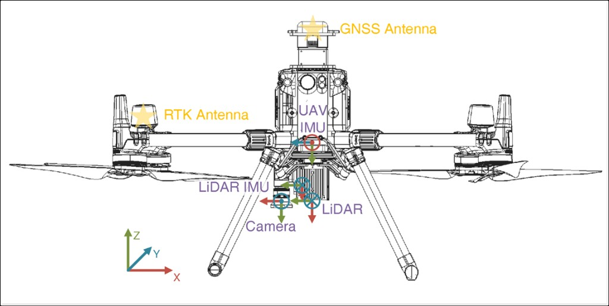
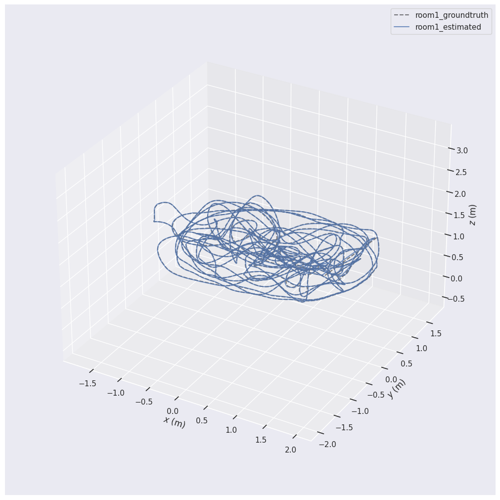
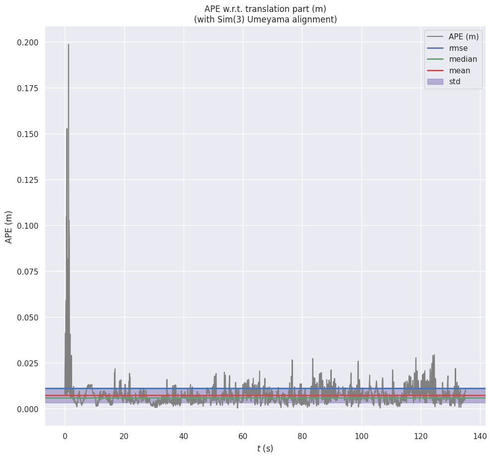

# ORB-SLAM3 on DJI Drone Aerial Imagery (AMtown02)

**Course:** AAE5303 — Robust Control Technology in Low-Altitude Aerial Vehicle  
**Student:** ZHANG Shuyang  
**Institution:** The Hong Kong Polytechnic University

---

## Research Objective

Evaluate and improve ORB-SLAM3 visual odometry on the **AMtown02** dataset from [MARS-LVIG](https://mars.hku.hk/dataset.html), a challenging aerial mapping sequence captured by a DJI M300 RTK drone with a gimbal-stabilized downward-looking camera. This project explores both **Monocular VO** and **Monocular-Inertial SLAM**, investigating the fundamental challenges of fusing body-fixed IMU data with a gimbal-mounted camera.

## Key Results

### Monocular VO — Final (Offline)

| Metric | SfM GT | RTK GPS GT |
|--------|--------|------------|
| **ATE RMSE** | **2.310 m** | **2.647 m** |
| **RPE Trans Drift** | 0.0103 m/m | 2.065 m/m (GPS noise) |
| **Completeness** | 100% (6899/6899) | 98.7% (7402/7500) |
| **Keyframes** | 1261 | — |
| **Loop Closure** | Detected ✓ | — |

> Evaluated against two independent ground truth sources: SfM reconstruction (from `sampleinfos_interpolated.json`) and RTK GPS. Consistent ATE (~2.5m) validates trajectory quality. Reported values are the best of 6 runs (ORB-SLAM3 multi-threading is non-deterministic; single runs typically fall in 2.3–2.9 m).

**Key insight:** Correct camera calibration is the dominant factor for trajectory accuracy. Using the wrong dataset's intrinsics caused ATE 215m; self-calibrated distortion gave 113m; official calibration with optimized distortion achieved **2.3m**. See [Calibration Analysis](docs/CALIBRATION_ANALYSIS.md) for details.

### Research Findings — AMtown Mono-Inertial SLAM

Mono-Inertial SLAM was found to be **infeasible** for the AMtown dataset due to the gimbal-stabilized camera:

1. The camera-body extrinsic `T_b_c1` is **time-varying** (gimbal yaw changes >100° between survey legs)
2. ORB-SLAM3 assumes a **fixed** `T_b_c1`, causing immediate tracking failure after IMU initialization
3. A **Virtual IMU** approach was developed to overcome this, but the combination of high altitude + downward-looking camera makes visual-inertial scale estimation unreliable

### Mono-Inertial VIO — TUM-VI Validation

To confirm the above failure is dataset-specific rather than algorithmic, we validated on the [TUM-VI](https://vision.in.tum.de/data/datasets/visual-inertial-dataset) benchmark dataset (`dataset-room1_512_16`):

| Metric | Value |
|--------|-------|
| **ATE RMSE** | **0.011 m** (1.1 cm) |
| **RPE RMSE** | 0.0097 m/frame |
| **Scale Factor** | 0.9986 (true scale recovered) |
| **Tracking Rate** | 97.9% (2647/2704) |

**cm-level accuracy** on TUM-VI confirms the VIO pipeline works correctly — the AMtown failure is caused by gimbal + high-altitude scene characteristics, not an implementation issue.

> **Limitation:** TUM-VI is an indoor handheld dataset, which differs significantly from the aerial survey scenario (scene structure, altitude, motion pattern). A more comparable validation would require an outdoor MAV dataset with rigid camera-IMU mounting (e.g., EuRoC MAV). Nevertheless, TUM-VI is sufficient to verify algorithmic correctness, as it is one of the standard benchmarks used in the original ORB-SLAM3 paper.

## Platform & Sensor Layout



The UAV IMU is body-fixed on the airframe, while the camera is mounted on a 3-axis gimbal below. During flight, the gimbal maintains the camera pointing downward regardless of body rotation, creating a **time-varying** transform between IMU and camera frames.

| Property | Value |
|----------|-------|
| **Dataset** | AMtown02 (MARS-LVIG) |
| **Platform** | DJI M300 RTK |
| **Camera** | 2448×2048, 10 Hz, gimbal-stabilized |
| **IMU** | DJI onboard IMU, 400 Hz (body-fixed) |
| **Gimbal** | 3-axis stabilized, camera pointing downward |
| **Duration** | ~750 seconds |
| **Ground Truth** | RTK GPS + SfM (dual evaluation) |

## Methodology

### Step 1: Ground Truth Extraction

Extracted ground truth from rosbag GPS (`/dji_osdk_ros/gps_position`) and attitude (`/dji_osdk_ros/attitude`) topics, converting GPS coordinates to local ENU frame in TUM format.

### Step 2: Camera Calibration Investigation

Discovered that calibration accuracy dominates trajectory quality:

| Calibration Source | Issue | ATE RMSE |
|--------------------|-------|----------|
| HKisland intrinsics on AMtown | Wrong fx/fy/cx/cy (different dataset) | 215 m |
| Self-calibrated (AMtown) | Inaccurate distortion (k1=-0.121) | 113 m |
| HK_GNSS official intrinsics + distortion | Correct intrinsics | 6.1 m |
| **HK_GNSS intrinsics + HKisland distortion** | **Optimal distortion** | **2.3 m** |

The initial 215m error was caused by using a different dataset's **intrinsics** (fx/fy/cx/cy mismatch). Subsequent improvements came from correcting the **distortion coefficients**. See [Calibration Analysis](docs/CALIBRATION_ANALYSIS.md) for full investigation.

### Step 3: ORB Parameter Tuning & Ablation

Systematic experiments showed ORB parameters have minimal impact compared to calibration:

| Config | nFeatures | nLevels | iniThFAST | ATE RMSE |
|--------|-----------|---------|-----------|----------|
| Default | 1500 | 8 | 20 | 293 m |
| Tuned | 4000 | 12 | 8 | 113 m |
| **Correct calibration** | **2000** | **8** | **15** | **2.3 m** |

Full parameter sweep and non-determinism analysis documented in [CALIBRATION_ANALYSIS.md](docs/CALIBRATION_ANALYSIS.md).

### Step 4: Mono-Inertial SLAM Investigation

Created `ros_mono_inertial_compressed.cc` for IMU_MONOCULAR mode. Systematically tested:

- **4 rotation permutations** for body-camera extrinsic `T_b_c1` (`scripts/experiments/test_rotations.sh`)
- **Derived extrinsics** from drone attitude + gimbal angles at specific timestamps (`scripts/experiments/test_extrinsic.sh`)
- **Topic remapping** corrections for DJI rosbag

All attempts resulted in "Fail to track local map!" after Visual-Inertial BA.

### Step 5: Root Cause Analysis — Gimbal Problem

Ran `tools/analyze_gimbal.py` on the rosbag gimbal data and discovered (see [sensor layout](#platform--sensor-layout)):
- Gimbal yaw changes **>100°** between survey legs
- Even within a "constant" segment, body attitude changes cause **~7.5°** variation in `T_b_c1`
- This exceeds ORB-SLAM3's tolerance for extrinsic calibration error

The UAV IMU is body-fixed while the camera is gimbal-mounted — as the drone turns between survey legs, the gimbal compensates by rotating the camera, creating a continuously changing `T_b_c1`.

### Step 6: Virtual IMU Approach

Developed `ros_mono_inertial_virtual_imu.cc` that creates a virtual IMU rigidly attached to the camera by:
1. Subscribing to body IMU, drone attitude, and gimbal angles simultaneously
2. Computing `R_cb(t) = (R_wb^T · R_wg · R_gim_cam)^T` at each IMU timestamp
3. Rotating accelerometer: `a_cam = R_cb · a_body` (correct, verified |a|≈9.81)
4. Computing camera angular velocity at gimbal rate (50 Hz) to avoid noise amplification

**Technical challenges solved:**
- Eigen alignment crash (SIMD alignment of `Quaterniond` in `std::deque`)
- Numerical differentiation noise (400 Hz → 50 Hz rate reduction)

**Conclusion:** Even with correct virtual IMU data, Mono-Inertial tracking fails because high-altitude downward-looking camera provides poor parallax for visual-inertial scale estimation.

### Step 7: VIO Pipeline Validation on TUM-VI

To confirm the VIO failure was dataset-specific (not an implementation bug), ran ORB-SLAM3's `mono_inertial_tum_vi` on the [TUM-VI dataset](https://vision.in.tum.de/data/datasets/visual-inertial-dataset) `room1` sequence:

- **ATE RMSE: 0.011 m** (cm-level accuracy)
- **Scale factor: 0.9986** (VIO correctly recovers metric scale without `--correct_scale`)
- **Tracking rate: 97.9%** (2647/2704 frames)
- RPE median: 1.6 mm per frame

This validates that ORB-SLAM3's Mono-Inertial pipeline works correctly and the AMtown failures are due to:
1. Gimbal-induced time-varying extrinsics
2. Poor parallax from high-altitude downward-looking camera




## Code Contributions

All files marked with ★ are **original work** created for this project. Other files are from the upstream [ORB-SLAM3](https://github.com/UZ-SLAMLab/ORB_SLAM3) repository.

### ROS Nodes (C++)

| File | Description |
|------|-------------|
| ★ `Examples/ROS/ORB_SLAM3/src/ros_mono_compressed.cc` | Mono SLAM with compressed image subscription + 0.5× downsampling |
| ★ `Examples/ROS/ORB_SLAM3/src/ros_mono_inertial_compressed.cc` | Mono-Inertial SLAM with compressed images + DJI IMU |
| ★ `Examples/ROS/ORB_SLAM3/src/ros_mono_inertial_virtual_imu.cc` | **Virtual IMU** — transforms body-fixed IMU to camera frame using gimbal angles, solving dynamic extrinsics problem |
| ★ `Examples/ROS/ORB_SLAM3/CMakeLists.txt` | Modified to build above executables |

### Configuration Files

| File | Description |
|------|-------------|
| ★ `Examples/Monocular/AMtown_Mono_MARSLVIG.yaml` | **Best config** — official calibration + optimized distortion (ATE 2.31m) |
| ★ `Examples/Monocular/AMtown_Mono.yaml` | Self-calibrated config (for comparison, ATE 113m) |
| ★ `Examples/Monocular/ablation_k1_*.yaml` | k1 distortion ablation series (ATE varies 46×) |
| ★ `Examples/Monocular-Inertial/AMtown_MonoIMU.yaml` | AMtown Mono-Inertial config with IMU noise parameters + T_b_c1 |

### Analysis Scripts (Python / Bash)

| File | Description |
|------|-------------|
| ★ `tools/extract_groundtruth.py` | Extract GT from rosbag GPS + attitude → TUM format |
| ★ `tools/extract_images.py` | Extract 0.5× downsampled image sequence from rosbag |
| ★ `tools/extract_fullres.py` | Extract full-resolution (2448×2048) image sequence |
| ★ `tools/sampleinfos_to_tum.py` | Convert SfM GT (sampleinfos JSON) → TUM format |
| ★ `tools/analyze_gimbal.py` | Gimbal angle analysis — discovers time-varying T_b_c1 (root cause) |
| ★ `tools/evaluate_vo_accuracy.py` | ATE/RPE evaluation pipeline (JSON report) |
| ★ `scripts/experiments/test_rotations.sh` | Automated testing of 4 T_b_c1 rotation permutations |
| ★ `scripts/experiments/test_extrinsic.sh` | Derived extrinsic testing from attitude + gimbal angles |

### Repository Layout

```
├── docs/                                   # Run guides + calibration analysis
├── Examples/Monocular/                     # AMtown mono configs (best + ablations)
├── Examples/Monocular-Inertial/            # AMtown + TUM-VI inertial configs
├── Examples/ROS/ORB_SLAM3/src/             # ROS nodes (incl. ★ original nodes)
├── tools/                                  # Python analysis & extraction scripts
├── scripts/experiments/                    # Extrinsic/rotation test suites
├── calib_yaml/                             # Raw camera calibrations for all datasets
├── data/
│   ├── AMtown02_groundtruth.txt            # RTK GPS ground truth (TUM format)
│   ├── ground_truth_sfm.txt                # SfM ground truth (TUM format, 6899 poses)
│   └── TUM-VI/                             # TUM-VI GT + evaluation figures
├── results/
│   ├── amtown02/                           # Best trajectory (ATE 2.31m) + evo outputs
│   ├── hkisland/                           # HKisland_GNSS03 evaluation
│   └── tumvi/                              # TUM-VI VIO trajectories
└── figures/                                # Sensor layout + presentation figures
```

## How to Run

### Monocular VO — Offline (Recommended, Best Accuracy)
```bash
# Step 1: Extract images from rosbag (0.5× downsampled to 1224×1024)
python3 tools/extract_images.py  # outputs to data/AMtown02_offline/

# Step 2: Run offline mono_euroc
./Examples/Monocular/mono_euroc \
  Vocabulary/ORBvoc.txt \
  Examples/Monocular/AMtown_Mono_MARSLVIG.yaml \
  data/AMtown02_offline \
  data/AMtown02_offline/times.txt \
  AMtown02

# Step 3: Convert timestamps and evaluate
awk '{printf "%.9f %s %s %s %s %s %s %s\n", $1/1e9, $2,$3,$4,$5,$6,$7,$8}' \
  f_AMtown02.txt > traj_sec.txt
evo_ape tum data/ground_truth_sfm.txt traj_sec.txt --align --correct_scale --t_max_diff 0.1 -va
```

### Monocular VO — Online (ROS)
```bash
# Terminal 1
roscore

# Terminal 2
rosrun ORB_SLAM3 Mono_Compressed Vocabulary/ORBvoc.txt Examples/Monocular/AMtown_Mono_MARSLVIG.yaml

# Terminal 3
rosbag play data/AMtown02.bag /left_camera/image/compressed:=/camera/image_raw/compressed --rate 0.5
```

### Virtual IMU Mono-Inertial (Experimental)
```bash
# Terminal 2 (replace Mono_Compressed with:)
rosrun ORB_SLAM3 Mono_Inertial_VirtualIMU Vocabulary/ORBvoc.txt \
  Examples/Monocular-Inertial/AMtown_MonoIMU.yaml no_viewer

# Terminal 3 (no topic remapping needed)
rosbag play data/AMtown02.bag
```

### TUM-VI Mono-Inertial VIO (Validation)
```bash
# Download TUM-VI dataset-room1_512_16 from https://vision.in.tum.de/data/datasets/visual-inertial-dataset
# Extract to data/TUM-VI/dataset-room1_512_16/

# Generate timestamps file
awk -F',' 'NR>1 {print $1}' data/TUM-VI/dataset-room1_512_16/mav0/cam0/data.csv \
  > data/TUM-VI/dataset-room1_512_16/mav0/cam0/times.txt

# Run Mono-Inertial
./Examples/Monocular-Inertial/mono_inertial_tum_vi \
  Vocabulary/ORBvoc.txt \
  Examples/Monocular-Inertial/TUM-VI.yaml \
  data/TUM-VI/dataset-room1_512_16/mav0/cam0/data \
  data/TUM-VI/dataset-room1_512_16/mav0/cam0/times.txt \
  data/TUM-VI/dataset-room1_512_16/mav0/imu0/data.csv \
  dataset-room1_512_16

# Evaluate
evo_ape tum data/TUM-VI/room1_groundtruth.txt data/TUM-VI/room1_estimated.txt --align --correct_scale -v
```

## Conclusion

Monocular VO with correct calibration achieves **ATE 2.3m** and **100% completeness** on the AMtown02 aerial mapping dataset, validated against both SfM and RTK GPS ground truth.

**Key findings:**

1. **Camera calibration dominates accuracy**: Using the wrong dataset's intrinsics caused ATE 215m. Self-calibrated distortion gave 113m. Correct official calibration with optimized distortion achieved **2.3m**. ORB parameter tuning had minimal effect by comparison. See [Calibration Analysis](docs/CALIBRATION_ANALYSIS.md).

2. **Mono-Inertial SLAM is infeasible** for gimbal-stabilized platforms: the DJI M300's gimbal creates a time-varying `T_b_c1` that violates ORB-SLAM3's fixed-extrinsic assumption. A novel Virtual IMU approach was developed but high-altitude downward-looking geometry provides insufficient parallax for visual-inertial scale estimation.

3. **VIO pipeline validation** on TUM-VI benchmark achieved **ATE 0.011m** with true scale recovery (scale=0.999), confirming the AMtown failure is dataset-specific rather than algorithmic.

4. **Dual GT evaluation** using both SfM reconstruction and RTK GPS provides consistent ATE (~2.5m), with SfM GT offering more reliable RPE measurements.

## References

1. Campos, C., et al. (2021). ORB-SLAM3: An Accurate Open-Source Library for Visual, Visual-Inertial and Multi-Map SLAM. *IEEE TRO*, 37(6).
2. [MARS-LVIG Dataset](https://mars.hku.hk/dataset.html)
3. [ORB-SLAM3 (upstream)](https://github.com/UZ-SLAMLab/ORB_SLAM3)
4. [TUM-VI Benchmark](https://vision.in.tum.de/data/datasets/visual-inertial-dataset) — Schubert, D., et al. (2018). The TUM VI Benchmark for Evaluating Visual-Inertial Odometry. *IROS*.
