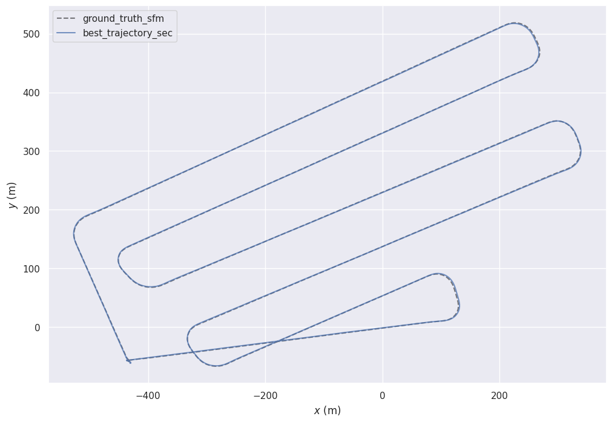
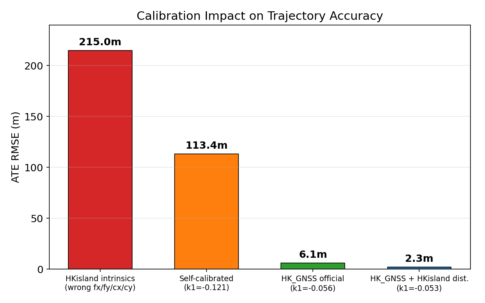
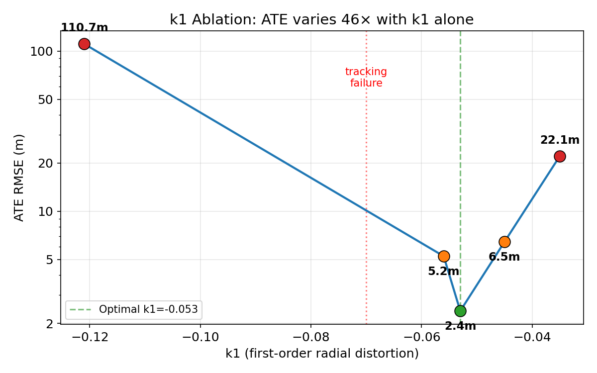

# ORB-SLAM3 on DJI Aerial Imagery — AMtown02

[](LICENSE)
[](http://wiki.ros.org/noetic)
[](https://isocpp.org/)
[](https://mars.hku.hk/dataset.html)

**Monocular visual odometry on a DJI M300 RTK aerial survey — 2.3 m ATE over a 750-second, 6,899-frame flight — plus a systematic analysis of why visual-inertial SLAM fundamentally fails on gimbal-stabilized platforms.**


*Estimated trajectory (solid) vs. SfM ground truth (dashed) on the AMtown02 lawnmower survey pattern — ATE RMSE 2.31 m over a roughly 900 × 600 m survey area.*

## Results at a Glance

| Metric | SfM GT | RTK GPS GT |
|--------|--------|------------|
| **ATE RMSE** | **2.310 m** | **2.647 m** |
| **RPE Trans Drift** | 0.0103 m/m | 2.065 m/m (GPS noise) |
| **Completeness** | 100% (6899/6899) | 98.7% (7402/7500) |
| **Keyframes** | 1261 | — |
| **Loop Closure** | Detected ✓ | — |

> Evaluated against two independent ground truth sources. Reported values are the best of 6 runs — ORB-SLAM3's multi-threading is non-deterministic and single runs typically land between 2.3 and 2.9 m.

This is a fork of [ORB-SLAM3](https://github.com/UZ-SLAMLab/ORB_SLAM3) adapted for the **AMtown02** sequence of [MARS-LVIG](https://mars.hku.hk/dataset.html): a DJI M300 RTK drone flying a mapping survey with a gimbal-stabilized, downward-looking 2448×2048 camera at 10 Hz. Original contributions are listed in [Code Contributions](#code-contributions).

---

## Finding 1 — Calibration Dominates Accuracy (215 m → 2.3 m)

The single biggest lever on trajectory accuracy was not ORB parameters, not resolution, not the SLAM configuration — it was camera calibration:



| Calibration Source | Issue | ATE RMSE |
|--------------------|-------|----------|
| HKisland intrinsics on AMtown | Wrong fx/fy/cx/cy (different dataset) | 215 m |
| Self-calibrated (AMtown) | Inaccurate distortion (k1=-0.121) | 113 m |
| HK_GNSS official intrinsics + distortion | Correct intrinsics | 6.1 m |
| **HK_GNSS intrinsics + HKisland distortion** | **Optimal distortion** | **2.3 m** |

An ablation isolating the first-order radial distortion coefficient shows **k1 alone changes ATE by 46×** (110.7 m at k1=-0.121 vs. 2.4 m at the optimum −0.053), with a tracking-failure cliff in between:



By comparison, an aggressive ORB parameter sweep (nFeatures 1500→4000, nLevels 8→12, iniThFAST 20→8) moved ATE by less than 3× — and running at full 2448×2048 resolution was *no better* than 0.5× downsampling. Full investigation in [docs/CALIBRATION_ANALYSIS.md](docs/CALIBRATION_ANALYSIS.md).

## Finding 2 — Why VIO Cannot Work on a Gimbal (a Negative Result)

Mono-inertial ORB-SLAM3 fails on this platform — **by design, not by bug**:


1. The drone's IMU is **body-fixed**; the camera hangs on a **3-axis gimbal** that keeps it pointing down regardless of body motion. Gimbal analysis (`tools/analyze_gimbal.py`) shows the camera-body extrinsic `T_b_c1` swings **>100° in yaw** between survey legs, with ~7.5° variation even within a "steady" leg.
2. ORB-SLAM3 — like virtually all VIO systems — assumes a **fixed** `T_b_c1`. Every configuration tested (4 rotation permutations, derived per-timestamp extrinsics) fails immediately after IMU initialization: *"Fail to track local map!"*
3. **Virtual IMU**: a custom ROS node ([`ros_mono_inertial_virtual_imu.cc`](Examples/ROS/ORB_SLAM3/src/ros_mono_inertial_virtual_imu.cc)) synthesizes an IMU rigidly attached to the camera by fusing body IMU + drone attitude + gimbal angles at 400 Hz: `R_cb(t) = (R_wb^T · R_wg · R_gim_cam)^T`, with accelerometer rotation verified (|a| ≈ 9.81) and angular velocity computed at gimbal rate (50 Hz) to limit differentiation noise. Even with correct virtual IMU data, tracking fails — at survey altitude looking straight down, parallax is too weak for visual-inertial scale estimation.

**Validation that the pipeline itself is sound:** the same VIO setup on the TUM-VI `room1` benchmark achieves **ATE 0.011 m** (1.1 cm) with true metric scale recovered (×0.9986) and 97.9% tracking — confirming the AMtown failure is a platform property, not an implementation error.

| TUM-VI room1 (VIO validation) | Value |
|-------------------------------|-------|
| ATE RMSE | **0.011 m** |
| Scale factor | 0.9986 (true scale) |
| Tracking rate | 97.9% (2647/2704) |

> **Takeaway:** gimbal-stabilized aerial platforms need VIO pipelines that model time-varying camera-body extrinsics — standard ORB-SLAM3 cannot be configured around this.

---

## Quick Start

### Docker (recommended)

```bash
git clone https://github.com/AfonsoZhang/ORB-SLAM3-DJI-AMtown.git
cd ORB-SLAM3-DJI-AMtown
docker build -t orbslam3-dji-amtown .

# Get AMtown02.bag into ./data/ first (instructions + checksum: scripts/download_dataset.sh)
docker run --rm -v "$PWD/data":/work/ORB-SLAM3-DJI-AMtown/data orbslam3-dji-amtown \
  bash -c "scripts/run_amtown.sh && scripts/evaluate.sh"
```

The pipeline is fully headless — no X server or GPU needed. One-time image
extraction takes ~10 min, the VO run ~13 min.

### Native

Prerequisites: Ubuntu 20.04, ROS Noetic, OpenCV 4.2, Eigen3, Pangolin v0.6, [`evo`](https://github.com/MichaelGrupp/evo) — exact recipe in the [Dockerfile](Dockerfile).

```bash
./build.sh                    # core library + offline examples
./build_ros.sh                # ROS nodes (optional, for online mode)
scripts/download_dataset.sh   # dataset instructions + checksum verification
scripts/run_amtown.sh         # extract images + run monocular VO
scripts/evaluate.sh           # evo ATE against both ground truths
```

Expected result: ATE RMSE in the **2.2–2.9 m** range — see [docs/REPRODUCIBILITY.md](docs/REPRODUCIBILITY.md) for the non-determinism analysis.

<details>
<summary><b>Online ROS mode</b></summary>

```bash
# Terminal 1
roscore

# Terminal 2
rosrun ORB_SLAM3 Mono_Compressed Vocabulary/ORBvoc.txt Examples/Monocular/AMtown_Mono_MARSLVIG.yaml

# Terminal 3
rosbag play data/AMtown02.bag /left_camera/image/compressed:=/camera/image_raw/compressed --rate 0.5
```
</details>

<details>
<summary><b>Virtual IMU mono-inertial (experimental, fails by design — see Finding 2)</b></summary>

```bash
# Terminal 2 (replace Mono_Compressed with:)
rosrun ORB_SLAM3 Mono_Inertial_VirtualIMU Vocabulary/ORBvoc.txt \
  Examples/Monocular-Inertial/AMtown_MonoIMU.yaml no_viewer

# Terminal 3 (no topic remapping needed)
rosbag play data/AMtown02.bag
```
</details>

<details>
<summary><b>TUM-VI VIO validation</b></summary>

```bash
# Download TUM-VI dataset-room1_512_16 from https://vision.in.tum.de/data/datasets/visual-inertial-dataset
# Extract to data/TUM-VI/dataset-room1_512_16/

awk -F',' 'NR>1 {print $1}' data/TUM-VI/dataset-room1_512_16/mav0/cam0/data.csv \
  > data/TUM-VI/dataset-room1_512_16/mav0/cam0/times.txt

./Examples/Monocular-Inertial/mono_inertial_tum_vi \
  Vocabulary/ORBvoc.txt \
  Examples/Monocular-Inertial/TUM-VI.yaml \
  data/TUM-VI/dataset-room1_512_16/mav0/cam0/data \
  data/TUM-VI/dataset-room1_512_16/mav0/cam0/times.txt \
  data/TUM-VI/dataset-room1_512_16/mav0/imu0/data.csv \
  dataset-room1_512_16

evo_ape tum data/TUM-VI/room1_groundtruth.txt data/TUM-VI/room1_estimated.txt --align --correct_scale -v
```
</details>

## Methodology

1. **Ground truth extraction** — RTK GPS (`/dji_osdk_ros/gps_position`) + attitude topics from the rosbag, converted to local ENU in TUM format (`tools/extract_groundtruth.py`); a second, independent GT from the dataset's SfM reconstruction (`tools/sampleinfos_to_tum.py`).
2. **Calibration investigation** — traced a 215 m ATE to mismatched intrinsics, then optimized distortion coefficients down to 2.3 m ([Finding 1](#finding-1--calibration-dominates-accuracy-215-m--23-m)).
3. **ORB parameter tuning & ablations** — parameter sweep, k1 ablation series (`Examples/Monocular/ablation_k1_*.yaml`), full-resolution comparison, 5-run non-determinism analysis.
4. **Mono-inertial investigation** — extrinsic permutation tests (`scripts/experiments/`), root-cause analysis of gimbal dynamics, Virtual IMU implementation ([Finding 2](#finding-2--why-vio-cannot-work-on-a-gimbal-a-negative-result)).
5. **Dual-GT evaluation** — every trajectory scored against both SfM and RTK GPS ground truth with `evo` (`tools/evaluate_vo_accuracy.py`).

## Code Contributions

Files marked ★ are original work for this project; everything else is upstream [ORB-SLAM3](https://github.com/UZ-SLAMLab/ORB_SLAM3).

| Area | Files |
|------|-------|
| **ROS nodes (C++)** | ★ `Examples/ROS/ORB_SLAM3/src/ros_mono_compressed.cc` (compressed images + 0.5× downsampling) · ★ `ros_mono_inertial_compressed.cc` (DJI IMU integration) · ★ `ros_mono_inertial_virtual_imu.cc` (**Virtual IMU** for time-varying extrinsics) |
| **Configs** | ★ `Examples/Monocular/AMtown_Mono_MARSLVIG.yaml` (best, ATE 2.31m) · ★ `AMtown_Mono.yaml`, `AMtown_A–E.yaml`, `ablation_k1_*.yaml` (sensitivity series) · ★ `Examples/Monocular-Inertial/AMtown_MonoIMU.yaml` |
| **Tools (Python)** | ★ `tools/extract_images.py`, `extract_fullres.py`, `extract_groundtruth.py`, `sampleinfos_to_tum.py`, `analyze_gimbal.py`, `evaluate_vo_accuracy.py` |
| **Experiments (Bash)** | ★ `scripts/experiments/test_rotations.sh`, `test_extrinsic.sh` |

## Repository Layout

```
├── docs/                          # Run guides + calibration analysis
├── Examples/Monocular[-Inertial]/ # AMtown + TUM-VI configs (incl. ablation series)
├── Examples/ROS/ORB_SLAM3/src/    # ROS nodes (incl. ★ original nodes)
├── tools/                         # Python extraction / analysis / evaluation scripts
├── scripts/experiments/           # Extrinsic & rotation test suites
├── calib_yaml/                    # Raw camera calibrations for all datasets
├── data/                          # Ground truths (TUM format); datasets go here (gitignored)
├── results/                       # Best trajectories + evo outputs per dataset
│   ├── amtown02/  ├── hkisland/  └── tumvi/
└── figures/                       # Sensor layout + result figures
```

## Roadmap

- Gimbal-aware VIO: support time-varying camera-body extrinsics ([#11](https://github.com/AfonsoZhang/ORB-SLAM3-DJI-AMtown/issues/11))
- EuRoC MAV benchmark for an aerial-platform VIO validation ([#10](https://github.com/AfonsoZhang/ORB-SLAM3-DJI-AMtown/issues/10))
- Mono VO vs. VIO cross-dataset comparison write-up ([#12](https://github.com/AfonsoZhang/ORB-SLAM3-DJI-AMtown/issues/12))

## Acknowledgments

Developed as the course project for **AAE5303 — Robust Control Technology in Low-Altitude Aerial Vehicle** at The Hong Kong Polytechnic University, by **ZHANG Shuyang**.

## References

1. Campos, C., et al. (2021). ORB-SLAM3: An Accurate Open-Source Library for Visual, Visual-Inertial and Multi-Map SLAM. *IEEE TRO*, 37(6).
2. [MARS-LVIG Dataset](https://mars.hku.hk/dataset.html) — HKU MARS Lab aerial LiDAR-Visual-IMU-GNSS dataset.
3. [ORB-SLAM3 (upstream)](https://github.com/UZ-SLAMLab/ORB_SLAM3)
4. Schubert, D., et al. (2018). [The TUM VI Benchmark](https://vision.in.tum.de/data/datasets/visual-inertial-dataset) for Evaluating Visual-Inertial Odometry. *IROS*.

## License

GPL-3.0, inherited from upstream ORB-SLAM3. See [LICENSE](LICENSE).
